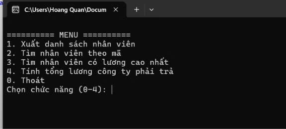
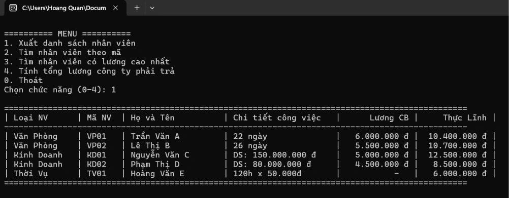
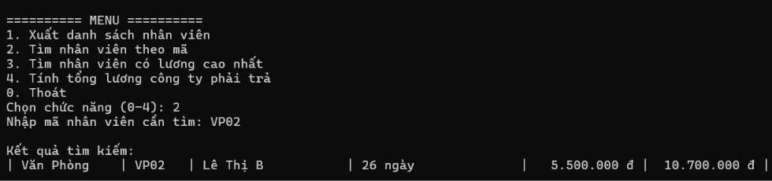
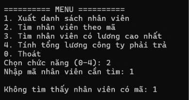
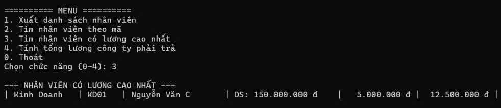
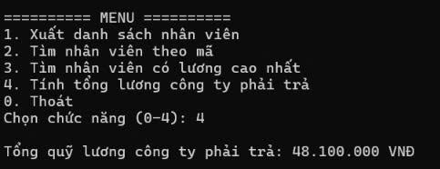
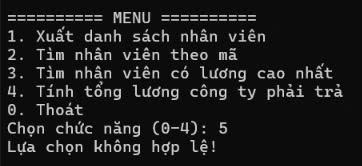
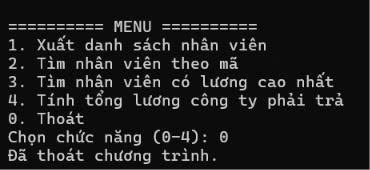
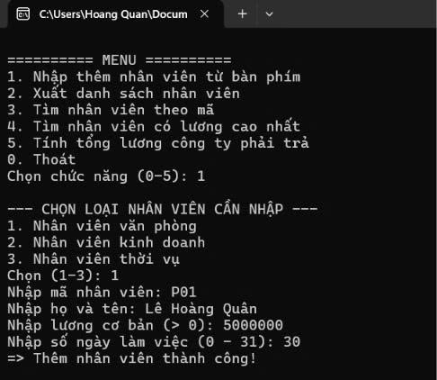

# COMP1019 - LẬP TRÌNH TRÊN WINDOWS

## BÀI TẬP LỚN / BÀI TẬP LỚP: QUẢN LÝ VÀ TÍNH LƯƠNG NHÂN VIÊN (OOP C# CONSOLE)

- **Sinh viên thực hiện:** Lê Hoàng Quân
- **Mã số sinh viên:** 51.01.104.082
- **Lớp:** 51.CNTT.A
- **Môi trường:** .NET / C# Console App, Microsoft Visual Studio

---

## 1. Mục tiêu bài tập

- Vận dụng đầy đủ 4 tính chất của **Lập trình hướng đối tượng (OOP)** trong C#:
  - **Đóng gói (Encapsulation):** Đóng gói thuộc tính bằng các Property (`get; set;`), kiểm tra tính hợp lệ dữ liệu.
  - **Kế thừa (Inheritance):** Xây dựng lớp cơ sở `NhanVien` và cho các lớp con (`NhanVienVanPhong`, `NhanVienKinhDoanh`, `NhanVienThoiVu`) kế thừa.
  - **Đa hình (Polymorphism):** Override linh hoạt các phương thức `NhapThongTin()`, `TinhLuong()`, `XuatHangBang()`.
  - **Trừu tượng (Abstraction):** Sử dụng `abstract class` và `abstract method` để định hình khung nghiệp vụ chung.
- Quản lý danh sách đối tượng đa hình bằng `List<NhanVien>`.
- Cung cấp menu tương tác cho phép người dùng **nhập thêm nhân viên trực tiếp từ bàn phím**.
- Định dạng bảng biểu hiển thị thông tin tiền tệ chuyên nghiệp trên giao diện Console.

---

## 2. Kiến trúc các lớp (Class Design)

### 2.1. Lớp cơ sở trừu tượng: `NhanVien` (abstract)

- **Thuộc tính chung:** `MaNV`, `HoTen`, `LuongCoBan`
- **Phương thức chính:**
  - `public virtual void NhapThongTin()`: Nhập mã, họ tên, lương cơ bản.
  - `public abstract decimal TinhLuong()`: Phương thức tính lương đa hình.
  - `public virtual void XuatHangBang()`: In thông tin nhân viên theo từng hàng của bảng.

### 2.2. Các lớp con dẫn xuất

1. **`NhanVienVanPhong` (Nhân viên văn phòng):**
   - Thuộc tính riêng: `SoNgayLamViec` (0 - 31 ngày).
   - Công thức lương: $$\text{Thực lĩnh} = \text{Lương cơ bản} + (\text{Số ngày làm việc} \times 200.000\,\text{đ})$$
2. **`NhanVienKinhDoanh` (Nhân viên kinh doanh):**
   - Thuộc tính riêng: `DoanhSo`
   - Công thức lương: $$\text{Thực lĩnh} = \text{Lương cơ bản} + (\text{Doanh số} \times 5\%)$$
3. **`NhanVienThoiVu` (Nhân viên thời vụ):**
   - Thuộc tính riêng: `SoGioLamViec`, `DonGiaGio` ($50.000\,\text{đ/h}$)
   - Công thức lương: $$\text{Thực lĩnh} = \text{Số giờ làm việc} \times 50.000\,\text{đ}$$

---

## 3. Danh mục chức năng chương trình

|                Chức năng                | Mô tả chi tiết                                                                                              |
| :-------------------------------------: | :---------------------------------------------------------------------------------------------------------- |
| **1. Nhập thêm nhân viên từ bàn phím**  | Cho phép lựa chọn loại nhân viên (Văn phòng, Kinh doanh, Thời vụ) và nhập các thông tin chi tiết tương ứng. |
|     **2. Xuất danh sách nhân viên**     | Hiển thị toàn bộ nhân viên dưới dạng bảng có phân loại, chi tiết công việc, lương CB và thực lĩnh.          |
|      **3. Tìm nhân viên theo mã**       | Tra cứu nhân viên theo mã (không phân biệt hoa/thường) và in kết quả tìm kiếm.                              |
| **4. Tìm nhân viên có lương cao nhất**  | Quét danh sách và hiển thị nhân viên có thực lĩnh cao nhất.                                                 |
| **5. Tính tổng lương công ty phải trả** | Tính tổng toàn bộ quỹ lương thực lĩnh công ty cần chi trả.                                                  |
|              **0. Thoát**               | Dừng và thoát khỏi chương trình an toàn.                                                                    |

---

## 4. Kết quả thực nghiệm & Minh chứng chức năng

> _Ghi chú: Toàn bộ ảnh chụp minh chứng được lưu trong thư mục `images/` của bài BTLOP._

### 4.1. Menu chính của chương trình

Giao diện Menu hiển thị danh mục các chức năng quản lý nhân viên.

_Mô tả: Giao diện Menu của ứng dụng._

---

### 4.2. Chức năng Xuất danh sách nhân viên

Bảng danh sách tổng hợp đầy đủ các nhân viên của công ty được căn chỉnh ngay ngắn theo từng cột.

_Mô tả: Bảng hiển thị danh sách nhân viên các bộ phận._

---

### 4.3. Chức năng Tìm nhân viên theo mã

- **Tìm thấy nhân viên:** Nhập mã `VP02`, hiển thị thông tin nhân viên Lê Thị B (Văn Phòng).

  

- **Không tìm thấy nhân viên:** Nhập mã `1`, thông báo `Không tìm thấy nhân viên có mã: 1`.

  

---

### 4.4. Chức năng Tìm nhân viên có lương cao nhất

Tìm ra nhân viên có mức thực lĩnh cao nhất công ty (Nguyễn Văn C - KD01 với $12.500.000\,\text{đ}$).

_Mô tả: Thông tin nhân viên có mức thu nhập cao nhất._

---

### 4.5. Chức năng Tính tổng lương công ty phải trả

Tính tổng lương thực lĩnh của toàn bộ nhân viên công ty phải chi trả: $48.100.000\,\text{VNĐ}$.

_Mô tả: Tổng quỹ lương công ty phải trả là 48.100.000 VNĐ._

---

### 4.6. Kiểm tra lỗi nhập liệu Menu

Khi nhập chức năng không hợp lệ, chương trình xuất cảnh báo `Lựa chọn không hợp lệ!`.

_Mô tả: Xử lý ngoại lệ khi chọn chức năng sai._

---

### 4.7. Thoát chương trình

Đóng ứng dụng và hiển thị thông báo `Đã thoát chương trình.`.

_Mô tả: Kết thúc ứng dụng an toàn._

---

### 4.8. Chức năng Nhập thêm nhân viên từ bàn phím

Chương trình hỗ trợ chọn loại hình nhân viên và nhập đầy đủ thông tin:

- Loại: `Nhân viên văn phòng`
- Mã nhân viên: `P01`
- Họ và tên: `Lê Hoàng Quân`
- Lương cơ bản: `5.000.000 đ`
- Số ngày làm việc: `30 ngày`
- Kết quả: Thêm nhân viên thành công vào hệ thống.

_Mô tả: Giao diện Menu mới kèm quá trình nhập thêm nhân viên từ bàn phím._

---
