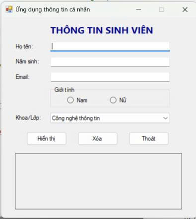
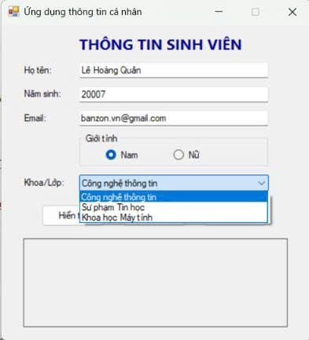
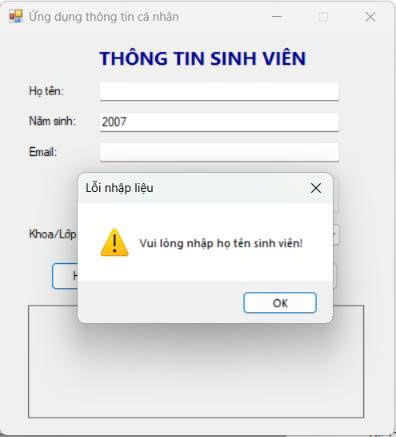
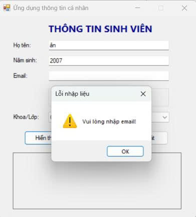
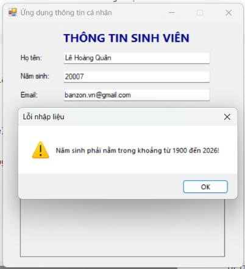
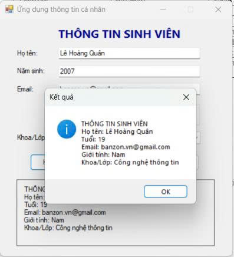
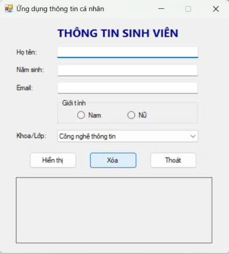
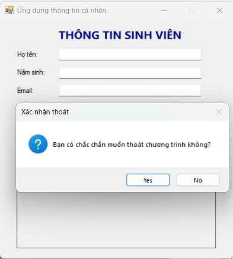

# COMP1019 - LẬP TRÌNH TRÊN WINDOWS

## BÀI LAB 01: ỨNG DỤNG THÔNG TIN CÁ NHÂN

- **Giảng viên hướng dẫn:** ThS. Lê Thanh Thoại
- **Sinh viên thực hiện:** Lê Hoàng Quân
- **Mã số sinh viên:** 51.01.104.082
- **Lớp:** 51.CNTT.A

---

## 1. Giới thiệu & Mục tiêu

Bài thực hành nhằm xây dựng ứng dụng **Windows Forms App** bằng ngôn ngữ **C#** trên môi trường **Visual Studio**, cho phép thu thập và xử lý thông tin cá nhân của sinh viên với các mục tiêu:

- Làm quen với cấu trúc project Windows Forms.
- Thiết kế giao diện với các control cơ bản: `Label`, `TextBox`, `RadioButton`, `ComboBox`, `Button`, `GroupBox`.
- Xử lý sự kiện `Click` cho các Button chức năng (`Hiển thị`, `Xóa`, `Thoát`).
- Kiểm tra tính hợp lệ của dữ liệu đầu vào (Data Validation) trước khi xử lý.
- Sử dụng `MessageBox` để hiển thị thông báo, cảnh báo lỗi và hộp thoại xác nhận.

---

## 2. Yêu cầu hệ thống & Công cụ phát triển

- **IDE:** Microsoft Visual Studio (2019/2022)
- **Framework:** .NET Framework / .NET Desktop Development
- **Ngôn ngữ:** C# (Windows Forms)

---

## 3. Thiết kế giao diện & Danh sách Controls

| STT | Loại Control  | Tên Control (`Name`) | Chức năng / Mô tả                         |
| :-: | :------------ | :------------------- | :---------------------------------------- |
|  1  | `Label`       | `lblTitle`           | Hiển thị tiêu đề "THÔNG TIN SINH VIÊN"    |
|  2  | `TextBox`     | `txtHoTen`           | Nhập họ và tên sinh viên                  |
|  3  | `TextBox`     | `txtNamSinh`         | Nhập năm sinh                             |
|  4  | `TextBox`     | `txtEmail`           | Nhập địa chỉ email                        |
|  5  | `RadioButton` | `radNam`, `radNu`    | Lựa chọn giới tính (nằm trong `GroupBox`) |
|  6  | `ComboBox`    | `cboKhoa`            | Danh sách khoa/ngành học                  |
|  7  | `Button`      | `btnHienThi`         | Kiểm tra dữ liệu và xuất thông tin        |
|  8  | `Button`      | `btnXoa`             | Xóa dữ liệu đã nhập về trạng thái ban đầu |
|  9  | `Button`      | `btnThoat`           | Mở hộp thoại xác nhận thoát chương trình  |
| 10  | `TextBox`     | `txtKetQua`          | Hiển thị kết quả tổng hợp sau khi xử lý   |

---

## 4. Xử lý logic chương trình

1. **Khởi tạo dữ liệu:**
   - Khi form khởi động, `cboKhoa` được nạp sẵn 3 mục lựa chọn:
     - `Công nghệ thông tin`
     - `Sư phạm Tin học`
     - `Khoa học Máy tính`
   - Mặc định chọn mục đầu tiên hoặc hiển thị placeholder.
2. **Kiểm tra dữ liệu đầu vào (`btnHienThi`):**
   - Họ tên không được để trống.
   - Năm sinh không được để trống, phải là định dạng số nguyên và nằm trong khoảng từ `1900` đến năm hiện tại (`2026`).
   - Email không được để trống.
   - Phải chọn một trong các giới tính (Nam / Nữ).
   - Phải chọn Khoa/Lớp tương ứng.
3. **Hiển thị thông tin:**
   - Tính toán tuổi: `Tuổi = Năm hiện tại (2026) - Năm sinh`.
   - Xuất kết quả chi tiết qua `MessageBox` thông báo (Information icon) và cập nhật đồng thời lên ô kết quả trên Form.
4. **Chức năng Xóa (`btnXoa`):**
   - Xóa trắng các `TextBox` nhập liệu và vùng kết quả.
   - Bỏ chọn các `RadioButton` giới tính.
   - Reset `cboKhoa` về trạng thái mặc định.
   - Đặt lại con trỏ chuột (`Focus`) vào ô nhập họ tên.
5. **Chức năng Thoát (`btnThoat`):**
   - Hiển thị `MessageBox` với tùy chọn `Yes/No` hỏi người dùng: _"Bạn có chắc chắn muốn thoát chương trình không?"_.
   - Chỉ đóng form khi người dùng nhấn `Yes`.

---

## 5. Kết quả thực nghiệm & Minh họa chức năng

> _Ghi chú: Đặt các file hình ảnh vào thư mục `images/` trong repository._

### 5.1. Giao diện khi khởi chạy chương trình

Giao diện ứng dụng ban đầu với các trường nhập liệu trống, danh sách khoa được khởi tạo và con trỏ chuột tự động focus vào ô nhập họ tên.



_Mô tả: Form khởi động thành công với đầy đủ các control._

---

### 5.2. Danh sách lựa chọn Khoa/Lớp

Danh mục khoa được nạp sẵn ít nhất 3 lựa chọn để sinh viên chọn.



_Mô tả: ComboBox hiển thị các chuyên ngành gồm Công nghệ thông tin, Sư phạm Tin học và Khoa học Máy tính._

---

### 5.3. Kiểm tra tính hợp lệ dữ liệu (Validation)

- **Trường hợp 1: Họ tên để trống**

  

  _Mô tả: Xuất cảnh báo `Vui lòng nhập họ tên sinh viên!` khi chưa điền họ tên._

- **Trường hợp 2: Email để trống**

  

  _Mô tả: Xuất cảnh báo `Vui lòng nhập email!` khi bỏ sót thông tin email._

- **Trường hợp 3: Năm sinh không hợp lệ**

  

  _Mô tả: Khi nhập năm sinh `20007`, hệ thống phát hiện lỗi ngoài khoảng cho phép và báo `Năm sinh phải nằm trong khoảng từ 1900 đến 2026!`._

---

### 5.4. Kết quả hiển thị khi nhập đúng thông tin

Khi dữ liệu hợp lệ (Họ tên: `Lê Hoàng Quân`, Năm sinh: `2007`, Email: `banzon.vn@gmail.com`, Giới tính: `Nam`, Khoa: `Công nghệ thông tin`), chương trình tính tuổi (`19`) và hiển thị kết quả lên cả `MessageBox` lẫn vùng kết quả trên Form.



_Mô tả: Hiển thị đầy đủ thông tin sinh viên và tuổi được tính chính xác._

---

### 5.5. Chức năng Xóa dữ liệu (Clear Form)

Sau khi nhấn nút **Xóa**, toàn bộ ô nhập liệu, giới tính và kết quả được đưa về trạng thái rỗng ban đầu.



_Mô tả: Dữ liệu được làm sạch, sẵn sàng cho lần nhập tiếp theo._

---

### 5.6. Xác nhận khi đóng chương trình

Nhấn nút **Thoát**, một hộp thoại xác nhận xuất hiện giúp tránh việc vô tình tắt ứng dụng.



_Mô tả: Hộp thoại xác nhận với hai nút lựa chọn Yes / No._

---

## 6. Hướng dẫn cài đặt và chạy chương trình

1. **Clone repository:**
   ```bash
   git clone <URL_REPOSITORY_CUA_BAN>
   ```
