# COMP1019 - LẬP TRÌNH TRÊN WINDOWS

## BUỔI 2 - LAB 02: C# CƠ BẢN - QUẢN LÝ MẢNG SỐ NGUYÊN BẰNG CONSOLE

- **Sinh viên thực hiện:** Lê Hoàng Quân
- **Mã số sinh viên:** 51.01.104.082
- **Lớp:** 51.CNTT.A
- **Môi trường:** .NET / C# Console App, Microsoft Visual Studio

---

## 1. Mục tiêu bài lab

- Nắm vững các cấu trúc cơ bản của C#: biến, kiểu dữ liệu, các vòng lặp (`do...while`, `for`, `foreach`), cấu trúc rẽ nhánh (`switch...case`).
- Khởi tạo, quản lý và xử lý dữ liệu với mảng một chiều (`int[]`).
- Rèn luyện kỹ thuật lập trình theo module: chia tách bài toán thành các phương thức (methods) độc lập, rõ ràng.
- Xử lý ngoại lệ và kiểm tra tính hợp lệ của dữ liệu nhập (Data Validation) bằng `int.TryParse`:
  - Bắt lỗi khi người dùng chọn sai chức năng Menu (chống crash).
  - Kiểm tra số lượng phần tử $n$ phải là số nguyên dương ($n > 0$).
  - Kiểm tra từng phần tử mảng phải đúng định dạng số nguyên.
- Chặn thực thi các chức năng tính toán nếu người dùng chưa thực hiện nhập mảng.

---

## 2. Danh sách các phương thức (Methods) trong chương trình

| STT | Tên phương thức                     | Kiểu trả về | Mô tả chức năng                                                         |
| :-: | :---------------------------------- | :---------: | :---------------------------------------------------------------------- |
|  1  | `HienThiMenu()`                     |   `void`    | In danh mục các chức năng (1 - 7) và tùy chọn thoát (0).                |
|  2  | `NhapSoNguyen(string message)`      |    `int`    | Nhập số nguyên an toàn, lặp yêu cầu nếu nhập sai định dạng.             |
|  3  | `NhapSoNguyenDuong(string message)` |    `int`    | Bắt buộc nhập số nguyên dương ($> 0$).                                  |
|  4  | `KiemTraDaNhapMang(bool daNhap)`    |   `bool`    | Kiểm tra trạng thái đã nhập mảng trước khi thực hiện các tính năng 2-7. |
|  5  | `NhapMang()`                        |   `int[]`   | Nhập số lượng phần tử $n$ và nhập từng giá trị phần tử.                 |
|  6  | `XuatMang(int[] a)`                 |   `void`    | In danh sách các phần tử mảng ra màn hình console.                      |
|  7  | `TinhTong(int[] a)`                 |    `int`    | Tính tổng giá trị tất cả các phần tử trong mảng.                        |
|  8  | `TimMax(int[] a)`                   |    `int`    | Tìm và trả về giá trị lớn nhất trong mảng.                              |
|  9  | `TimMin(int[] a)`                   |    `int`    | Tìm và trả về giá trị nhỏ nhất trong mảng.                              |
| 10  | `DemChan(int[] a)`                  |    `int`    | Đếm số lượng phần tử chẵn ($x \pmod 2 == 0$).                           |
| 11  | `DemLe(int[] a)`                    |    `int`    | Đếm số lượng phần tử lẻ ($x \pmod 2 \neq 0$).                           |
| 12  | `SapXepTangDan(int[] a)`            |   `void`    | Sắp xếp mảng tăng dần bằng thuật toán Bubble Sort.                      |
| 13  | `TimKiem(int[] a, int x)`           |    `int`    | Trả về vị trí index đầu tiên của $x$, trả về $-1$ nếu không tồn tại.    |

---

## 3. Kết quả thực nghiệm và minh chứng chức năng

> _Ghi chú: Toàn bộ ảnh chụp màn hình minh chứng được đặt tại thư mục `images/` trong thư mục `Lab02`._

### 3.1. Giao diện Menu chính

Menu hiển thị đầy đủ 7 chức năng nghiệp vụ kèm tùy chọn thoát (0).

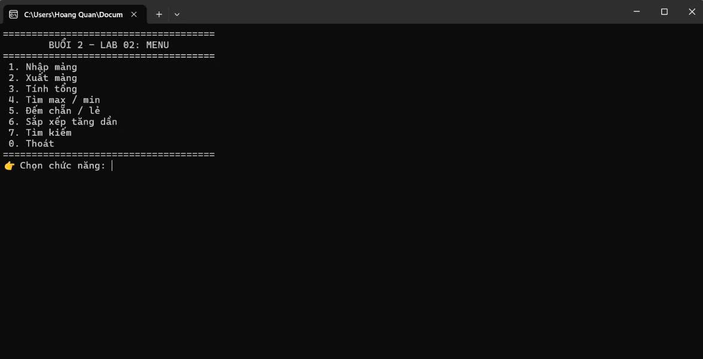

_Mô tả: Giao diện Menu khởi đầu của chương trình._

---

### 3.2. Chức năng 1: Nhập mảng

Nhập số lượng phần tử $n = 5$ và lần lượt các giá trị: `1, 2, 3, 4, 5`.

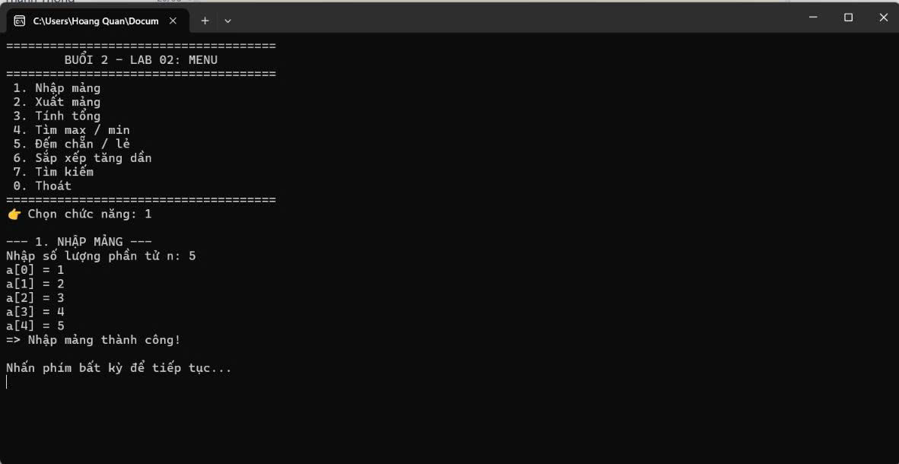

_Mô tả: Nhập thành công mảng 5 phần tử._

---

### 3.3. Chức năng 2: Xuất mảng

Hiển thị tất cả các phần tử hiện có trong mảng ra màn hình console.

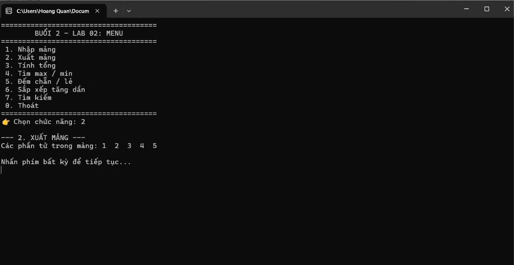

_Mô tả: Xuất các phần tử `1  2  3  4  5`._

---

### 3.4. Chức năng 3: Tính tổng

Tính tổng các giá trị trong mảng: $1 + 2 + 3 + 4 + 5 = 15$.

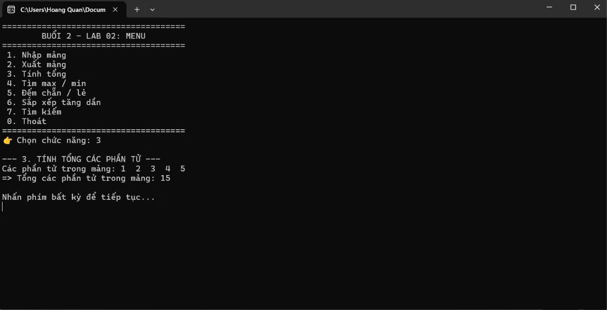

_Mô tả: Kết quả tính tổng hiển thị chính xác là 15._

---

### 3.5. Chức năng 4: Tìm lớn nhất (Max) và nhỏ nhất (Min)

Quét mảng và trả về giá trị lớn nhất ($Max = 5$) cùng giá trị nhỏ nhất ($Min = 1$).

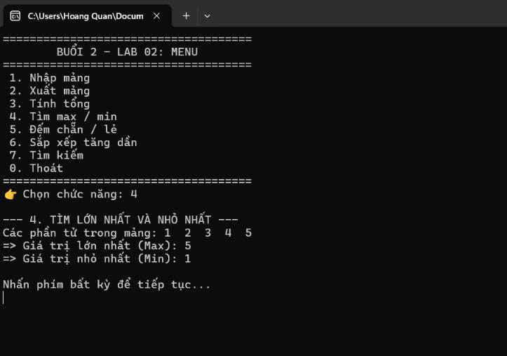

_Mô tả: Giá trị lớn nhất là 5, giá trị nhỏ nhất là 1._

---

### 3.6. Chức năng 5: Đếm số lượng chẵn / lẻ

Phân loại và đếm số lượng:

- Số chẵn: $2, 4 \rightarrow 2$ phần tử
- Số lẻ: $1, 3, 5 \rightarrow 3$ phần tử

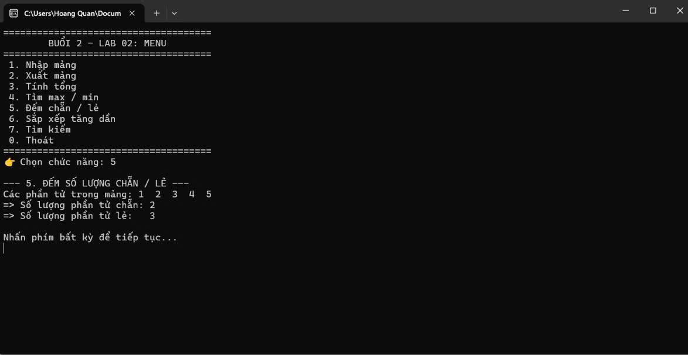

_Mô tả: Đếm chính xác 2 phần tử chẵn và 3 phần tử lẻ._

---

### 3.7. Chức năng 6: Sắp xếp tăng dần

Hiển thị trạng thái mảng trước và sau khi thực hiện sắp xếp nổi bọt (Bubble Sort).

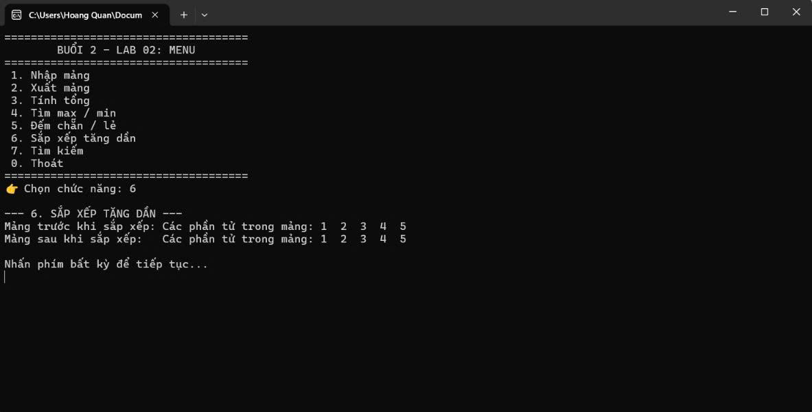

_Mô tả: Mảng sau khi sắp xếp đúng thứ tự tăng dần `1  2  3  4  5`._

---

### 3.8. Chức năng 7: Tìm kiếm phần tử (Trường hợp tìm thấy)

Nhập giá trị cần tìm $x = 5$. Chương trình quét mảng và trả về vị trí index đầu tiên tìm thấy.

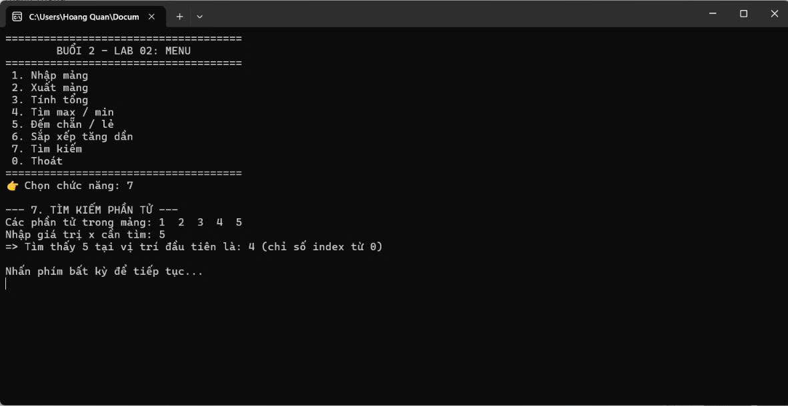

_Mô tả: Tìm thấy giá trị 5 tại vị trí index thứ 4 trong mảng._

---

### 3.9. Kiểm tra lỗi chọn Menu không hợp lệ

Khi người dùng nhập chức năng nằm ngoài phạm vi $0 - 7$ (ví dụ chọn `8`), hệ thống xuất cảnh báo đỏ và cho phép nhập lại mà không bị dừng chương trình đột ngột.

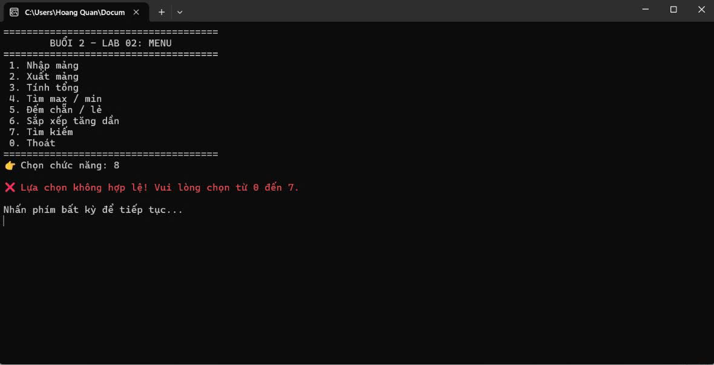

_Mô tả: Báo lỗi "Lựa chọn không hợp lệ! Vui lòng chọn từ 0 đến 7." khi nhập chức năng 8._

---

### 3.10. Kiểm tra ràng buộc dữ liệu đầu vào (Validation)

- Nhập $n = 0$: Báo lỗi yêu cầu $n$ phải là số nguyên dương ($> 0$).
- Nhập chuỗi sai định dạng số nguyên cho phần tử: Báo lỗi và yêu cầu nhập lại đúng giá trị cho phần tử đó.

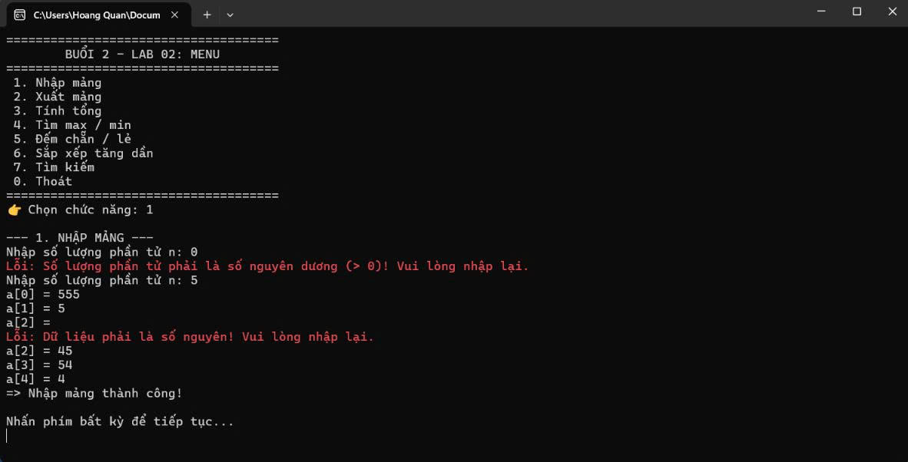

_Mô tả: Xử lý ngoại lệ chống crash khi nhập sai $n$ và nhập sai kiểu dữ liệu phần tử._

---

### 3.11. Chức năng 7: Tìm kiếm phần tử (Trường hợp không tìm thấy)

Nhập giá trị $x = 0$ cần tìm trong mảng `555  5  45  54  4`. Chương trình duyệt hết mảng và thông báo không tìm thấy giá trị.

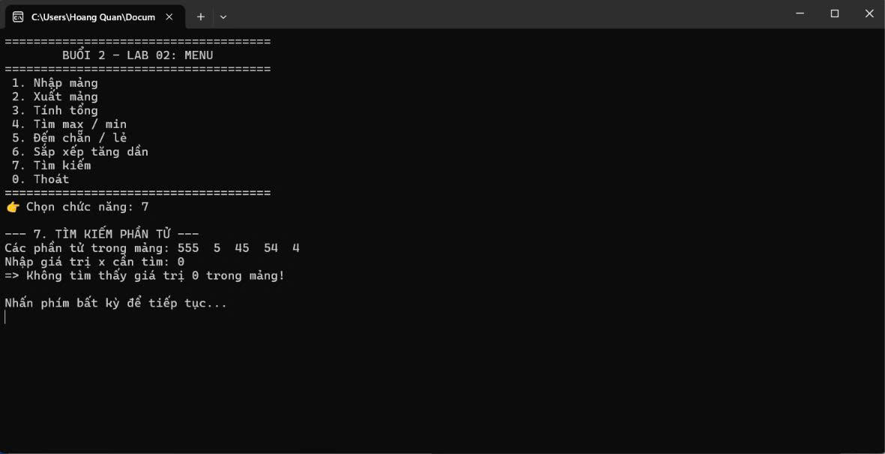

_Mô tả: Thông báo rõ ràng "Không tìm thấy giá trị 0 trong mảng!"._

---
