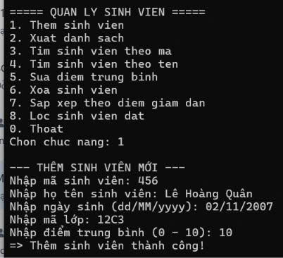
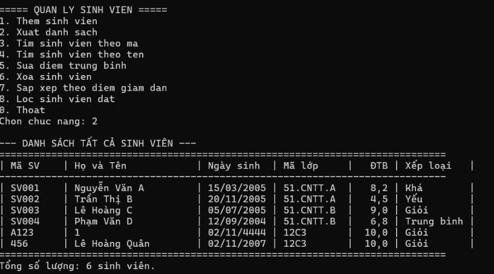
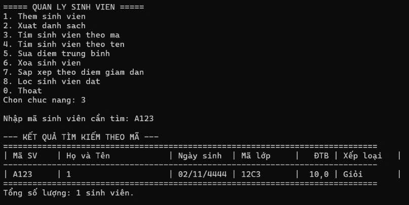
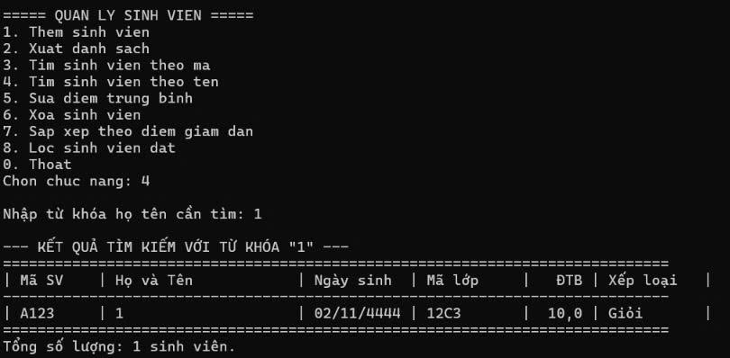
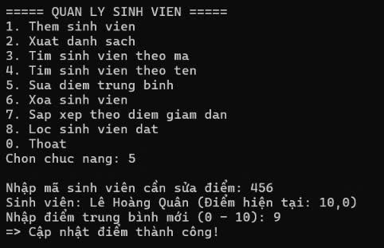
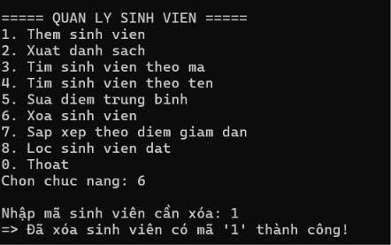
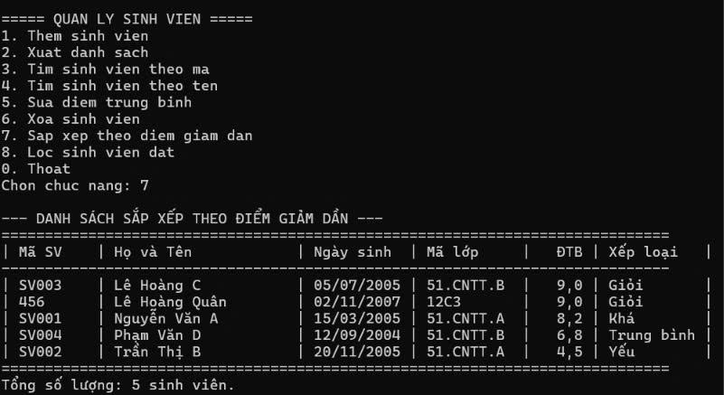
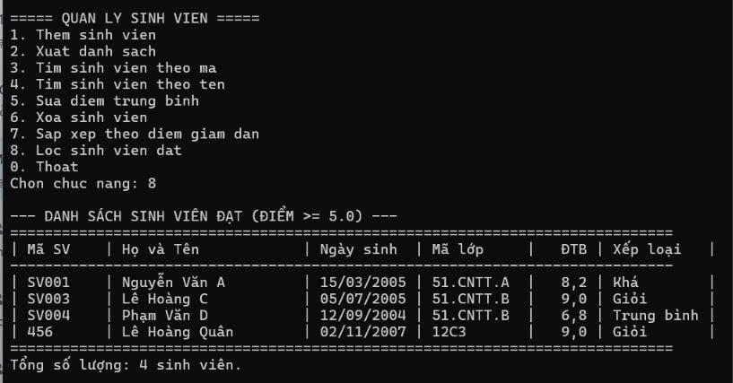

# COMP1019 - LẬP TRÌNH TRÊN WINDOWS

## BÀI LAB 03: C# VÀ LẬP TRÌNH HƯỚNG ĐỐI TƯỢNG – QUẢN LÝ SINH VIÊN BẰNG CONSOLE

- **Giảng viên hướng dẫn:** ThS. Lê Thanh Thoại
- **Sinh viên thực hiện:** Lê Hoàng Quân
- **Mã số sinh viên:** 51.01.104.082
- **Lớp:** 51.CNTT.A

---

## 1. Giới thiệu & Mục tiêu

Bài thực hành nhằm xây dựng ứng dụng **Console Application** quản lý sinh viên bằng ngôn ngữ **C#** trên môi trường **Visual Studio**, áp dụng toàn diện các nguyên lý lập trình hướng đối tượng (OOP) và kỹ thuật xử lý dữ liệu hiện đại với các mục tiêu:

- Vận dụng kiến thức về Class, Object, Property, Constructor và tính Đóng gói (Encapsulation).
- Mô hình hóa quan hệ kế thừa (Inheritance): lớp `SinhVien` kế thừa từ lớp `Nguoi`.
- Quản lý tập hợp đối tượng bằng cấu trúc dữ liệu `List<SinhVien>`.
- Tổ chức kiến trúc phân tầng: tách biệt tầng giao diện (`Program.cs`) và tầng dịch vụ nghiệp vụ (`QuanLySinhVien.cs`).
- Ứng dụng các phương thức LINQ cơ bản (`Any`, `FirstOrDefault`, `Where`, `OrderByDescending`) để tìm kiếm, lọc và sắp xếp dữ liệu.
- Xử lý ngoại lệ và kiểm tra tính hợp lệ của dữ liệu đầu vào (Validation), đảm bảo chương trình không bị dừng đột ngột khi nhập sai.

---

## 2. Yêu cầu hệ thống & Công cụ phát triển

- **IDE:** Microsoft Visual Studio (2019/2022) / VS Code
- **Framework:** .NET 8.0 / .NET 9.0 / .NET 10.0 Console Application
- **Ngôn ngữ:** C#

---

## 3. Cấu trúc chương trình & Danh sách các lớp

| STT | Tên Class        | Thuộc tính / Phương thức chính                                                                        | Vai trò / Yêu cầu kỹ thuật                                                                                                               |
| :-: | :--------------- | :---------------------------------------------------------------------------------------------------- | :--------------------------------------------------------------------------------------------------------------------------------------- |
|  1  | `Nguoi`          | `HoTen`, `NgaySinh` `LayThongTin()` (virtual)                                                      | Là lớp cha (Base Class), chứa constructor khởi tạo và phương thức hiển thị có thể override.                                              |
|  2  | `SinhVien`       | `MaSinhVien`, `MaLop`, `DiemTrungBinh` `XepLoai()`, `LayThongTin()` (override)                     | Kế thừa từ `Nguoi`, kiểm tra ràng buộc `DiemTrungBinh` từ 0 đến 10, phân loại học lực và ghi đè thông tin.                               |
|  3  | `QuanLySinhVien` | `Them()`, `SuaDiem()`, `Xoa()`, `TimTheoMa()`, `TimTheoTen()`, `SapXepTheoDiem()`, `LocSinhVienDat()` | Tầng Service đóng gói `List<SinhVien>`, thực hiện toàn bộ thao tác CRUD và xử lý LINQ, không để `Program` can thiệp trực tiếp danh sách. |
|  4  | `Program`        | `Main()`, `HienThiMenu()`, các hàm nhập liệu từ bàn phím                                              | Điều khiển luồng chương trình, điều hướng menu Console và bắt lỗi nhập liệu.                                                             |

---

## 4. Xử lý logic chương trình

1. **Khởi tạo dữ liệu mẫu:**
   - Khi khởi động, nạp sẵn 4 sinh viên mẫu vào danh sách để thuận tiện kiểm thử các chức năng lọc, tìm kiếm và sắp xếp.
2. **Thêm sinh viên mới (Chức năng 1):**
   - Mã sinh viên không được để trống và không được trùng với các mã đã có (dùng `Any()` để kiểm tra).
   - Họ tên và mã lớp không được bỏ trống.
   - Ngày sinh phải đúng định dạng `dd/MM/yyyy`.
   - Điểm trung bình chỉ nhận số thực trong khoảng từ `0` đến `10`.
3. **Xuất danh sách (Chức năng 2):**
   - In bảng danh sách căn lề thẳng hàng, hiển thị: Mã SV, Họ và Tên, Ngày sinh, Mã lớp, ĐTB và Xếp loại.
4. **Tìm kiếm (Chức năng 3 & 4):**
   - Tìm theo mã: dùng `FirstOrDefault()` so sánh chính xác mã sinh viên.
   - Tìm theo tên: dùng `Where()` lọc các sinh viên có họ tên chứa từ khóa tìm kiếm (không phân biệt hoa thường).
5. **Cập nhật & Xóa (Chức năng 5 & 6):**
   - Sửa điểm: Kiểm tra mã sinh viên tồn tại, nếu có thì nhập điểm mới (0–10) và cập nhật.
   - Xóa sinh viên: Xóa đối tượng khỏi danh sách theo mã đã nhập.
6. **Sắp xếp & Lọc bằng LINQ (Chức năng 7 & 8):**
   - Sắp xếp giảm dần theo điểm: Dùng `OrderByDescending(s => s.DiemTrungBinh)`.
   - Lọc sinh viên đạt: Dùng `Where(s => s.DiemTrungBinh >= 5.0)`.

---

## 5. Kết quả thực nghiệm & Minh họa chức năng

> _Ghi chú: Đặt các file ảnh chụp minh chứng vào thư mục `images/` trong thư mục bài nộp._

### 5.1. Thêm sinh viên mới từ bàn phím (Chức năng 1)

Nhập đầy đủ thông tin sinh viên hợp lệ: Mã SV `456`, Họ tên `Lê Hoàng Quân`, Ngày sinh `02/11/2007`, Lớp `12C3`, Điểm `10`.

_Mô tả: Hệ thống tiếp nhận dữ liệu và thông báo `=> Thêm sinh viên thành công!`._

---

### 5.2. Xuất toàn bộ danh sách sinh viên (Chức năng 2)

Danh sách được hiển thị dưới dạng bảng ngay ngắn, tự động tính cột xếp loại theo thang điểm.

_Mô tả: Bảng hiển thị đầy đủ thông tin 6 sinh viên đã có trong hệ thống._

---

### 5.3. Tìm kiếm sinh viên theo mã (Chức năng 3)

Nhập mã sinh viên `A123` để tra cứu thông tin chính xác.

_Mô tả: Trích xuất và hiển thị thông tin sinh viên có mã tương ứng dạng bảng._

---

### 5.4. Tìm kiếm sinh viên theo tên (Chức năng 4)

Nhập từ khóa tìm kiếm `"1"`, chương trình lọc ra tất cả sinh viên có họ tên chứa ký tự này.

_Mô tả: Kết quả tìm kiếm hiển thị các sinh viên thỏa mãn từ khóa tìm kiếm._

---

### 5.5. Cập nhật sửa điểm trung bình (Chức năng 5)

Nhập mã sinh viên `456`, chương trình hiển thị tên cùng điểm hiện tại (`10,0`), sau đó cho phép cập nhật điểm mới thành `9`.

_Mô tả: Điểm số được cập nhật thành công vào bộ nhớ (`=> Cập nhật điểm thành công!`)._

---

### 5.6. Xóa sinh viên khỏi danh sách (Chức năng 6)

Nhập mã sinh viên cần xóa `1`. Hệ thống tìm kiếm theo mã và thực hiện xóa sinh viên ra khỏi bộ nhớ danh sách.

_Mô tả: Thông báo xác nhận xóa thành công `=> Đã xóa sinh viên có mã '1' thành công!`._

---

### 5.7. Sắp xếp danh sách theo điểm giảm dần bằng LINQ (Chức năng 7)

Áp dụng LINQ để sắp xếp lại thứ tự sinh viên theo điểm từ cao nhất xuống thấp nhất.

_Mô tả: Sinh viên có điểm số cao nhất hiển thị ở đầu bảng, thứ tự giảm dần chính xác._

---

### 5.8. Lọc danh sách sinh viên đạt (Điểm >= 5.0) bằng LINQ (Chức năng 8)

Lọc và xuất các sinh viên có điểm trung bình từ `5.0` trở lên thông qua phương thức `Where()` của LINQ.

_Mô tả: Kết quả lọc hiển thị 4 sinh viên đạt chuẩn (SV001, SV003, SV004 và 456 - Lê Hoàng Quân), sinh viên SV002 có ĐTB 4,5 đã được lọc bỏ chính xác._

---
