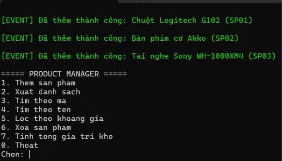
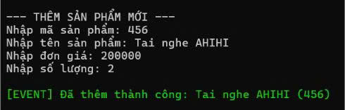
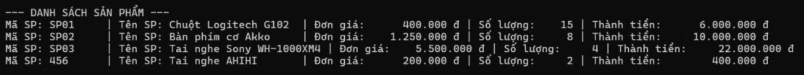
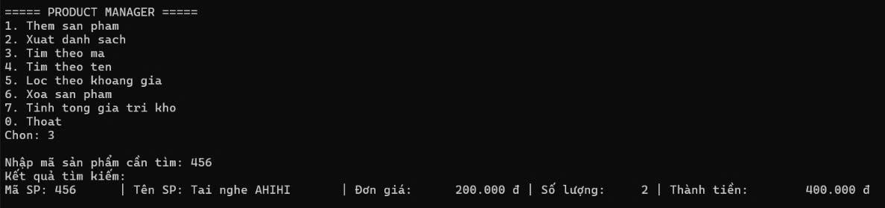
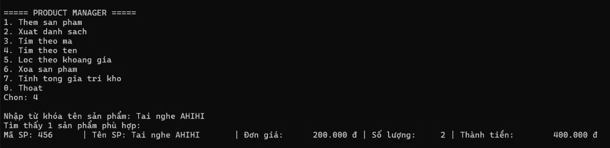
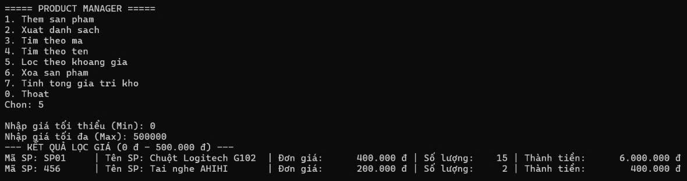
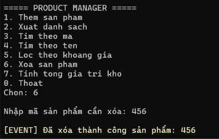
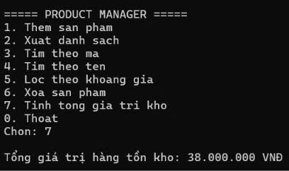
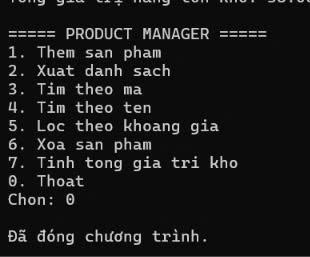

# COMP1019 - LẬP TRÌNH TRÊN WINDOWS
## BUỔI 4 - LAB 04: EXCEPTION, DELEGATE/EVENT, FUNC/ACTION VÀ GENERIC TRONG C#

* **Sinh viên thực hiện:** Lê Hoàng Quân
* **Mã số sinh viên:** 51.01.104.082
* **Lớp:** 51.CNTT.A
* **Môi trường phát triển:** .NET / C# Console App, Microsoft Visual Studio

---

## 1. Mục tiêu bài lab
* **Exception Handling:** Vận dụng `try-catch`, `throw` và xây dựng các Exception tự tạo (`DuplicateProductException`, `ProductNotFoundException`) để bắt và xử lý lỗi nghiệp vụ chặt chẽ.
* **Delegate & Event:** Sử dụng `event Action<...>` để phát tín hiệu thông báo khi dữ liệu trong kho thay đổi (thêm sản phẩm mới hoặc xóa sản phẩm thành công).
* **Func / Lambda Expression:** Vận dụng `Func<Product, bool>` để truyền điều kiện lọc động theo khoảng giá và tìm kiếm linh hoạt.
* **Generic Repository Pattern:** Xây dựng generic class `Repository<T>` với ràng buộc `where T : IEntity` để tái sử dụng code quản lý danh sách đối tượng trong bộ nhớ.
* **Kiến trúc phân tầng:** Tách biệt rõ ràng giữa tầng lưu trữ dữ liệu (`Repository<T>`), tầng nghiệp vụ (`ProductService`) và giao diện người dùng (`Program`).

---

## 2. Thiết kế hệ thống & Cấu trúc Class

### 2.1. Interface & Class thực thể
* **`IEntity`:** Interface chứa thuộc tính `string Id { get; }` làm ràng buộc generic cho `Repository<T>`.
* **`Product`:** Kế thừa `IEntity` (`Id => MaSP`).
  * Thuộc tính: `MaSP`, `TenSP`, `Price` (đơn giá $\ge 0$), `Quantity` (số lượng $\ge 0$).
  * Phương thức tính thành tiền: `ThanhTien => Price * Quantity`.

### 2.2. Custom Exceptions (Exception tự tạo)
* **`DuplicateProductException`:** Ném ra khi thêm sản phẩm có mã đã tồn tại trong kho.
* **`ProductNotFoundException`:** Ném ra khi thực hiện xóa hoặc tìm sản phẩm theo mã không tồn tại.

### 2.3. Generic Repository & Service
* **`Repository<T> where T : IEntity`:** 
  * `Add(T item)`: Thêm đối tượng vào danh sách.
  * `Remove(string id)`: Xóa đối tượng theo Id.
  * `FindById(string id)`: Tìm kiếm đối tượng theo Id.
  * `Find(Func<T, bool> predicate)`: Lọc danh sách theo biểu thức điều kiện `Func`.
  * `GetAll()`: Lấy toàn bộ danh sách đối tượng.
* **`ProductService`:** Đảm nhận kiểm tra nghiệp vụ, gọi `Repository<Product>` và kích hoạt các event:
  * `event Action<Product> OnProductAdded;` (bắn thông báo khi thêm thành công).
  * `event Action<string> OnProductRemoved;` (bắn thông báo khi xóa thành công).

---

## 3. Danh mục chức năng chương trình

| Phím chọn | Chức năng | Mô tả chi tiết |
| :---: | :--- | :--- |
| **1** | Thêm sản phẩm | Nhập mã, tên, giá, số lượng; kiểm tra trùng mã và phát event khi thêm thành công. |
| **2** | Xuất danh sách | In danh sách toàn bộ sản phẩm cùng đơn giá, số lượng và thành tiền. |
| **3** | Tìm theo mã | Tìm kiếm chính xác sản phẩm theo mã định danh `MaSP`. |
| **4** | Tìm theo tên | Tìm kiếm gần đúng theo từ khóa tên sản phẩm (`TenSP.Contains(...)`). |
| **5** | Lọc theo khoảng giá | Sử dụng `Func<Product, bool>` để lọc sản phẩm trong tầm giá từ Min đến Max. |
| **6** | Xóa sản phẩm | Xóa sản phẩm theo mã và phát event thông báo xóa thành công. |
| **7** | Tính tổng giá trị kho | Tính tổng thành tiền của toàn bộ sản phẩm hiện có trong kho hàng. |
| **0** | Thoát | Dừng và đóng chương trình. |

---

## 4. Kết quả thực nghiệm & Minh chứng chức năng

> *Ghi chú: Toàn bộ ảnh chụp minh chứng được lưu trong thư mục `images/` thuộc thư mục `Lab04`.*

### 4.1. Khởi động chương trình & Tải dữ liệu mẫu
Khi khởi động, hệ thống nạp sẵn dữ liệu mẫu ban đầu và kích hoạt sự kiện `[EVENT]` thông báo thêm thành công lên màn hình Console, sau đó hiển thị Menu chính.

*Mô tả: Phát event nạp 3 sản phẩm mẫu ban đầu và hiển thị Menu Product Manager.*

---

### 4.2. Chức năng 1: Thêm sản phẩm mới
Nhập thông tin sản phẩm mới:
* Mã SP: `456`
* Tên SP: `Tai nghe AHIHI`
* Đơn giá: `200.000 đ`
* Số lượng: `2`
* Kích hoạt sự kiện: `[EVENT] Đã thêm thành công: Tai nghe AHIHI (456)`

*Mô tả: Nhập sản phẩm và kích hoạt Event thông báo thêm thành công.*

---

### 4.3. Chức năng 2: Xuất danh sách sản phẩm
Xuất toàn bộ 4 sản phẩm hiện có trong kho hàng kèm định dạng tiền tệ và tính toán thành tiền chi tiết.

*Mô tả: Danh sách sản phẩm đầy đủ thông tin mã, tên, đơn giá, số lượng, thành tiền.*

---

### 4.4. Chức năng 3: Tìm kiếm sản phẩm theo mã
Nhập mã `456`, hệ thống sử dụng phương thức `FindById` trong Generic Repository để trả về kết quả sản phẩm `Tai nghe AHIHI`.

*Mô tả: Tìm thấy chính xác sản phẩm theo mã 456.*

---

### 4.5. Chức năng 4: Tìm kiếm theo tên sản phẩm
Nhập từ khóa `Tai nghe AHIHI`, hệ thống tìm kiếm và hiển thị 1 sản phẩm phù hợp.

*Mô tả: Tìm thấy sản phẩm chứa từ khóa tên cần tìm.*

---

### 4.6. Chức năng 5: Lọc theo khoảng giá (Sử dụng `Func<Product, bool>`)
Nhập khoảng giá tìm kiếm:
* Giá tối thiểu (Min): `0`
* Giá tối đa (Max): `500.000`
* Kết quả lọc ra 2 sản phẩm thỏa điều kiện `p => p.Price >= min && p.Price <= max`:
  * `SP01 - Chuột Logitech G102` (400.000 đ)
  * `456 - Tai nghe AHIHI` (200.000 đ)

*Mô tả: Lọc sản phẩm theo khoảng giá bằng biểu thức Func.*

---

### 4.7. Chức năng 6: Xóa sản phẩm
Nhập mã sản phẩm cần xóa: `456`. Hệ thống xóa sản phẩm khỏi Repository và kích hoạt event:
`[EVENT] Đã xóa thành công sản phẩm: 456`.

*Mô tả: Xóa sản phẩm và phát Event thông báo xóa thành công.*

---

### 4.8. Chức năng 7: Tính tổng giá trị kho hàng
Sau khi đã xóa sản phẩm mã `456` (400.000 đ), tổng giá trị hàng tồn kho còn lại là:
$$6.000.000 + 10.000.000 + 22.000.000 = 38.000.000\,\text{VNĐ}$$

*Mô tả: Tính tổng giá trị toàn bộ kho hàng chính xác là 38.000.000 VNĐ.*

---

### 4.9. Chức năng 0: Thoát chương trình
Chọn `0`, ứng dụng hiển thị thông báo `Đã đóng chương trình.` và kết thúc an toàn.

*Mô tả: Đóng chương trình an toàn.*

---
