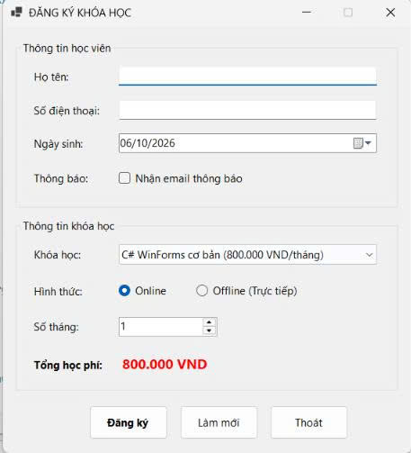
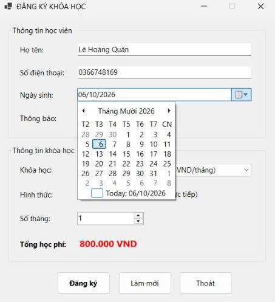
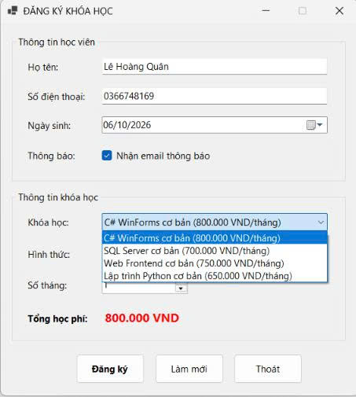
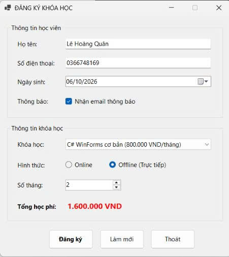
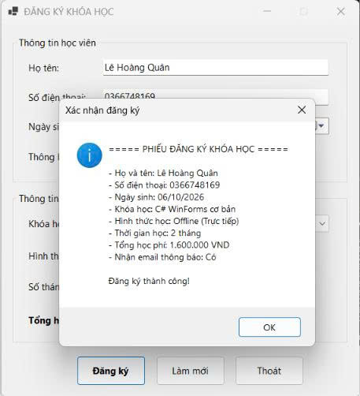
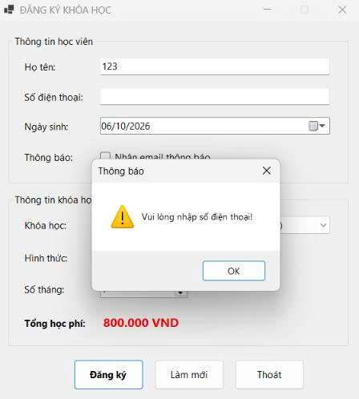
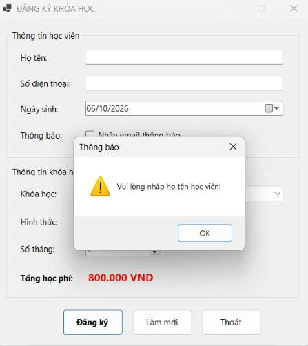
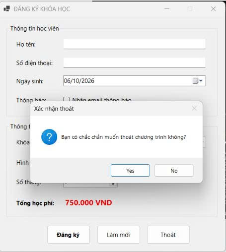

# COMP1019 - LẬP TRÌNH TRÊN WINDOWS

## BÀI LAB BUỔI 5: WINDOWS FORMS CƠ BẢN - ỨNG DỤNG ĐĂNG KÝ KHÓA HỌC (CourseRegistrationApp)

- **Giảng viên hướng dẫn:** ThS. Lê Thanh Thoại - Khoa Công nghệ Thông tin, HCMUE
- **Sinh viên thực hiện:** Lê Hoàng Quân
- **Mã số sinh viên:** 51.01.104.082
- **Lớp:** 51.CNTT.A
- **Môi trường phát triển:** .NET / C# Windows Forms App, Microsoft Visual Studio

---

## 1. Mục tiêu bài lab

- Thiết kế giao diện ứng dụng Windows Forms trực quan bằng **Form Designer**, **Toolbox** và cửa sổ **Properties**.
- Sử dụng thành thạo các control cơ bản: `Label`, `TextBox`, `Button`, `ComboBox`, `RadioButton`, `CheckBox`, `DateTimePicker`, `NumericUpDown`, `GroupBox`.
- Tuân thủ quy ước đặt tên control chuẩn nghiệp vụ (`txt...`, `btn...`, `cbo...`, `rad...`, `dtp...`, `num...`, `chk...`, `lbl...`).
- Xử lý đa dạng các sự kiện tương tác:
  - `Form_Load`: Khởi tạo danh sách khóa học và các giá trị mặc định ban đầu.
  - `SelectedIndexChanged` và `ValueChanged`: Tự động tính toán lại tổng học phí khi người dùng đổi khóa học hoặc tăng giảm số tháng học.
  - `Click`: Xử lý các nút bấm **Đăng ký**, **Làm mới** và **Thoát**.
- Kiểm tra dữ liệu nhập (Validation) trước khi xử lý và hiển thị kết quả/cảnh báo bằng `MessageBox`.

---

## 2. Thiết kế giao diện & Danh sách Controls

Form chính có tiêu đề: **`ĐĂNG KÝ KHÓA HỌC`**, bố cục gồm 2 `GroupBox` phân nhóm thông tin và 1 vùng nút lệnh:

| Nhóm                   |   Loại Control   | Tên Control (`Name`) | Chức năng / Mô tả                                     |
| :--------------------- | :--------------: | :------------------- | :---------------------------------------------------- |
| **Thông tin học viên** |    `GroupBox`    | `grpThongTinHocVien` | Gom nhóm thông tin cá nhân của học viên               |
|                        |    `TextBox`     | `txtHoTen`           | Nhập họ và tên học viên                               |
|                        |    `TextBox`     | `txtSoDienThoai`     | Nhập số điện thoại liên hệ                            |
|                        | `DateTimePicker` | `dtpNgaySinh`        | Chọn ngày tháng năm sinh                              |
|                        |    `CheckBox`    | `chkNhanEmail`       | Tùy chọn nhận email thông báo                         |
| **Thông tin khóa học** |    `GroupBox`    | `grpThongTinKhoaHoc` | Gom nhóm thông tin khóa học đăng ký                   |
|                        |    `ComboBox`    | `cboKhoaHoc`         | Danh sách các khóa học để lựa chọn                    |
|                        |  `RadioButton`   | `radOnline`          | Chọn hình thức học trực tuyến (Online)                |
|                        |  `RadioButton`   | `radOffline`         | Chọn hình thức học trực tiếp (Offline)                |
|                        | `NumericUpDown`  | `numSoThang`         | Chọn số tháng đăng ký (Tối thiểu: 1, Tối đa: 12)      |
|                        |     `Label`      | `lblTongTien`        | Hiển thị tổng học phí (định dạng tiền tệ VNĐ, màu đỏ) |
| **Vùng nút lệnh**      |     `Button`     | `btnDangKy`          | Kiểm tra dữ liệu và xuất phiếu đăng ký                |
|                        |     `Button`     | `btnLamMoi`          | Reset toàn bộ dữ liệu trên form về mặc định           |
|                        |     `Button`     | `btnThoat`           | Hộp thoại xác nhận đóng ứng dụng                      |

---

## 3. Dữ liệu khóa học & Xử lý nghiệp vụ

### 3.1. Bảng giá các khóa học

- **C# WinForms cơ bản:** 800.000 VNĐ / tháng
- **SQL Server cơ bản:** 700.000 VNĐ / tháng
- **Web Frontend cơ bản:** 750.000 VNĐ / tháng
- **Lập trình Python cơ bản:** 650.000 VNĐ / tháng

### 3.2. Quy tắc tính toán & Nghiệp vụ

- **Công thức tính học phí:**
  $$\text{Tổng học phí} = \text{Đơn giá khóa học (1 tháng)} \times \text{Số tháng}$$
- **Tự động cập nhật:** Khi thay đổi mục chọn trong `cboKhoaHoc` hoặc tăng/giảm giá trị trong `numSoThang`, tổng học phí được tự động tính và cập nhật ngay lập tức.
- **Kiểm tra hợp lệ khi Đăng ký:**
  - Họ tên không được để trống.
  - Số điện thoại không được để trống.
  - Phải chọn khóa học hợp lệ.
- **Xác nhận thoát:** Hiển thị hộp thoại hỏi `Yes/No`, chỉ đóng form khi người dùng nhấn `Yes`.

---

## 4. Kết quả thực nghiệm & Minh chứng chức năng

> _Ghi chú: Toàn bộ ảnh chụp màn hình được đặt trong thư mục `images/` cùng cấp với file `README.md`._

### 4.1. Khởi tạo ứng dụng khi Form Load

Khi khởi động, ComboBox được nạp sẵn 4 khóa học, mặc định chọn khóa đầu tiên (_C# WinForms cơ bản_), hình thức mặc định là _Online_, số tháng mặc định là _1_ và tổng học phí ban đầu hiển thị là **800.000 VND**.

_Mô tả: Giao diện form khởi tạo chuẩn với các giá trị mặc định._

---

### 4.2. Chọn ngày sinh qua DateTimePicker

Hỗ trợ giao diện lịch trực quan để chọn chính xác ngày tháng năm sinh của học viên.

_Mô tả: Dropdown lịch hiển thị khi chọn ngày sinh._

---

### 4.3. Danh sách lựa chọn khóa học trong ComboBox

ComboBox hiển thị đầy đủ danh sách 4 khóa học kèm đơn giá từng tháng.

_Mô tả: Danh sách khóa học được nạp đầy đủ vào ComboBox._

---

### 4.4. Tự động tính học phí khi thay đổi thông tin

Khi thay đổi hình thức sang _Offline (Trực tiếp)_ và tăng số tháng đăng ký lên **2 tháng**, nhãn tổng học phí tự động cập nhật:
$$800.000 \times 2 = \mathbf{1.600.000\,\text{VND}}$$

_Mô tả: Tổng học phí tự động nhân theo số tháng đăng ký._

---

### 4.5. Đăng ký thành công & Xuất phiếu đăng ký

Khi nhập đầy đủ dữ liệu và nhấn nút **Đăng ký**, một hộp thoại `MessageBox` xuất hiện tổng hợp toàn bộ thông tin đăng ký khóa học của học viên.

_Mô tả: Hộp thoại xác nhận đăng ký thành công với đầy đủ các trường thông tin._

---

### 4.6. Kiểm tra hợp lệ: Bắt lỗi để trống số điện thoại

Nếu bỏ trống ô số điện thoại và bấm Đăng ký, hệ thống kích hoạt hộp thoại cảnh báo: `Vui lòng nhập số điện thoại!`.

_Mô tả: Cảnh báo khi người dùng không điền số điện thoại._

---

### 4.7. Kiểm tra hợp lệ: Bắt lỗi để trống họ tên học viên

Nếu bỏ trống ô họ tên học viên, hệ thống phát hiện lỗi và cảnh báo: `Vui lòng nhập họ tên học viên!`.

_Mô tả: Cảnh báo khi người dùng để trống họ tên._

---

### 4.8. Chức năng Thoát có xác nhận (Yes/No)

Nhấn nút **Thoát**, một hộp thoại hỏi `Bạn có chắc chắn muốn thoát chương trình không?` hiển thị giúp tránh việc vô tình tắt ứng dụng.

_Mô tả: Hộp thoại xác nhận trước khi đóng Form._

---
